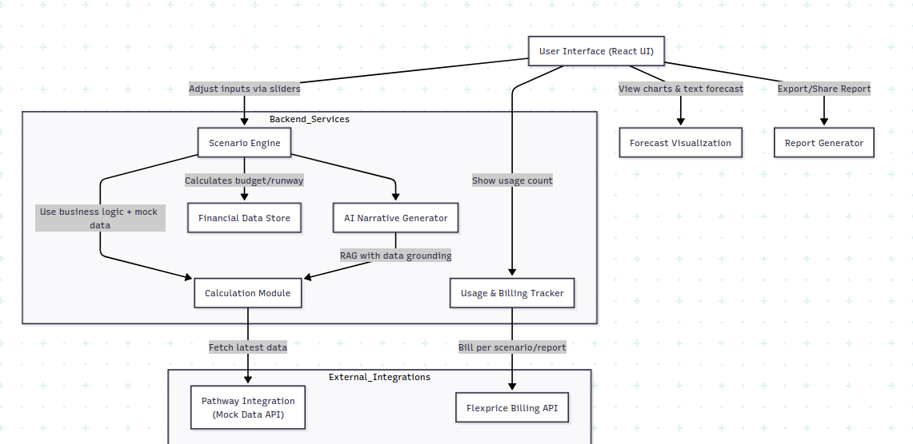

<body>
  <h1>CFO Helper Agent</h1>
  
<strong>CFO Helper Agent</strong> is an AI-powered financial assistant designed to simplify financial analysis and scenario planning for businesses. It helps CFOs, finance teams, and startup founders upload financial data and generate insights, forecasts, and scenario outcomes instantly.

## Screenshot 
The following diagram illustrates the overall flow of the CFO Helper Agent  

  <h2>🚀 Features</h2>
  <ul>
    <li>📊 <strong>Automated Financial Analysis</strong> – Revenue, expenses, cash flow, P&amp;L, balance sheet, and more.</li>
    <li>🔄 <strong>Scenario Simulation</strong> – Model the impact of spending changes, pricing adjustments, new hires, and marketing budgets.</li>
    <li>📂 <strong>Multi-Format Support</strong> – Upload <code>.xlsx</code> or <code>.csv</code> financial files for instant analysis.</li>
    <li>🧾 <strong>Startup Runway Calculator</strong> – Evaluate growth models and runway planning.</li>
    <li>📈 <strong>Interactive Dashboard</strong> – Visualize and compare financial outcomes.</li>
  </ul>

  <h2>🛠️ Tech Stack</h2>
  <h3>Frontend</h3>
  <ul>
    <li>React.js</li>
    <li>TailwindCSS</li>
  </ul>
  <h3>Backend</h3>
  <ul>
    <li>Python (FastAPI / Flask)</li>
    <li>Pathway (real-time data processing)</li>
    <li>Pandas, NumPy</li>
  </ul>
  <h3>Database (Optional)</h3>
  <ul>
    <li>PostgreSQL / SQLite</li>
  </ul>
  <h3>Others</h3>
  <ul>
    <li>Docker</li>
    <li>Nginx</li>
  </ul>

  <h2>⚙️ Setup</h2>
  <h3>Prerequisites</h3>
  <ul>
    <li>Python 3.9+</li>
    <li>Node.js 18+</li>
    <li>npm or yarn</li>
    <li>Docker (optional)</li>
  </ul>

  <h3>Clone Repository</h3>
  <pre><code>git clone https://github.com/SyedImtiyaz-1/CFO-Agent.git
cd CFO-Agent</code></pre>

  <h3>Backend Setup</h3>
  <pre><code>cd cfo-helper/backend
pip install -r requirements.txt
python main.py</code></pre>

  <h3>Frontend Setup</h3>
  <pre><code>cd cfo-helper/frontend
npm install
npm start</code></pre>

  
Access the dashboard at: <a href="http://localhost:3000/agent">http://localhost:3000/agent</a>

  <h2>📂 Sample Financial Data</h2>
  <ul>
    <li><code>monthly-financials.xlsx</code> – Revenue, expenses, cash flow</li>
    <li><code>quarterly-pl.xlsx</code> – Quarterly P&amp;L with EBITDA</li>
    <li><code>cash-flow.xlsx</code> – Detailed cash flow analysis</li>
    <li><code>balance-sheet.xlsx</code> – Assets, liabilities, equity</li>
    <li><code>startup-model.xlsx</code> – 18-month financial model &amp; runway</li>
    <li><code>revenue-breakdown.xlsx</code> – Product-wise revenue breakdown</li>
    <li><code>expenses-breakdown.csv</code> – Category-wise expense tracking</li>
  </ul>

  <h2>👥 Collaboration</h2>
  <ul>
    <li>👤 <a href="https://github.com/abhirami01950">Abhirami</a></li>
    <li>👤 <a href="https://github.com/SyedImtiyaz-1">Syed Imtiyaz Ali</a></li>
  </ul>
</body>
</html>
